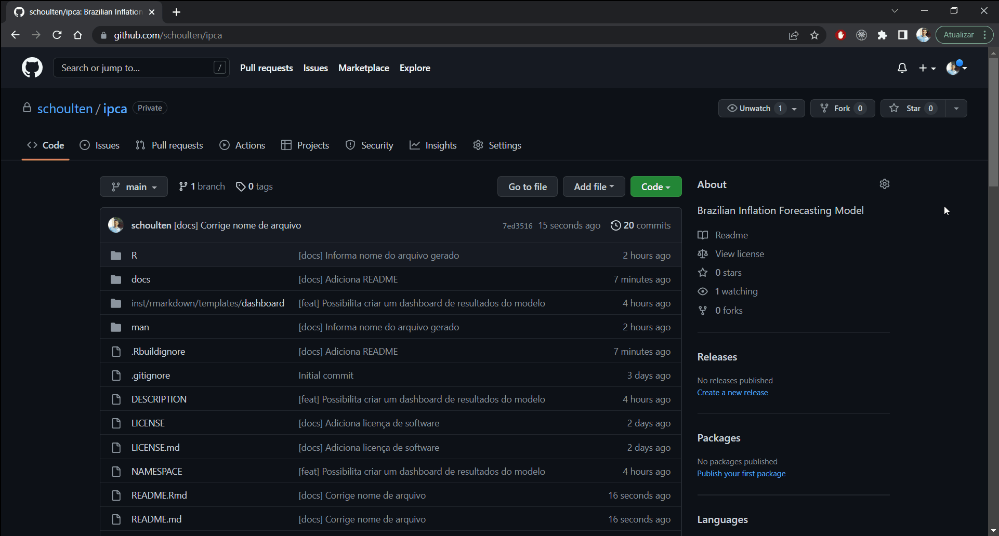

```{r, file = "./rmd/setup.R", include=FALSE}
```


```{css, echo=FALSE}
pre {
  white-space: pre-wrap;
  overflow-y: scroll !important;
  max-height: 45vh !important;
  overflow-x: auto;
  max-width: 100%;
}
.tiny85 .remark-code {
  font-size: 85%; !important;
}
.tiny75 .remark-code {
  font-size: 75%; !important;
}
.tiny65 .remark-code {
  font-size: 65%; !important;
}
.tiny55 .remark-code {
  font-size: 55%; !important;
}
.tiny45 .remark-code {
  font-size: 45%; !important;
}
```


### Temas de hoje


- Por que empacotar o código?
- Criando a estrutura de arquivos
  - Usando o `{usethis}`
  - Repositório local e licença de software
  - Preenchendo a descrição
- Modularizando o código em funções
  - Criando as funções
  - Testando as funções
  - Testando o pacote
  - Declarando dependências
  - Documentando as funções
  - Fluxo de trabalho
  - Resumo das funções criadas
- Deploy do pacote
  - Teste local com o `{devtools}`
  - Subindo o pacote para o GitHub
  - Instalação a partir do GitHub
  - Criando testes automatizados com GitHub Actions
  - Criando rotina de automatização do modelo


---
class: middle, center, inverse
# Por que empacotar o código?


---
### Por que empacotar o código?

Quando criamos um pacote de R estamos, em verdade, criando um software. Dessa forma, o motivo de desenvolver um pacote é, primariamente, propiciar utilidades para benefício de outras pessoas. Em outras palavras, é uma forma de generalizar procedimentos para que outras pessoas possam usufruir do seu código para proveito próprio.

Em se tratando de um código de um modelo de previsão, podemos destacar algumas vantagens ao empacotá-lo:

- Em uma empresa, possibilita que outros usuários (possivelmente leigos) instalem seu pacote para ter acesso facilitado à estimação/previsão do modelo;
- Mantém código, dados, documentação, etc. tudo compactado em apenas um lugar;
- Você pode rodar o modelo e obter previsões virtualmente em qualquer computador, basta ter o pacote instalado, sem precisar copiar e colar manualmente o código do modelo;
- A generalização do código pode tornar seu uso mais propício em ambientes de produção e na nuvem;
- Permite utilizar testes de software para maior robustez em relação a boas práticas de programação e de reprodutibilidade.

Dito isso, **o objetivo dessa aula é criar um pacote simples que comporte, como exemplo, o código do modelo de previsão do IPCA**. A ideia é manter tudo o mais simples e funcional possível, pois o tópico é avançado; dessa forma, não nos aprofundaremos muito sobre as minúcias de desenvolvimento de pacotes, mas você pode se aprofundar no assunto com o livro *R Packages* do Hadley Wickham, referência dessa aula.


---
class: middle, center, inverse
# Criando a estrutura de arquivos


---
### Usando o `{usethis}`

Para criar a estrutura básica de um pacote primeiro defina o diretório de trabalho na sessão do R e, em seguida, execute o comando abaixo, onde o nome do pacote está entre aspas:

```r
usethis::create_package("ipca")
```

O comando criará os seguintes arquivos:

- `.gitignore` antecipa o uso do Git e cria um arquivo de instruções ao Git para ignorar no repositório alguns arquivos padrão criados automaticamente pelo R e RStudio (`.Rproj.user`, `.Rhistory`, etc.);
- `.Rbuildignore` lista os arquivos que precisamos ter, mas que não devem ser incluídos ao compilar o pacote;
- `DESCRIPTION` fornece metadados (descrição) sobre seu pacote;
- `ipca.Rproj` é o arquivo que torna o diretório em um projeto de RStudio;
- `NAMESPACE` declara as funções que seu pacote exporta para uso externo e as funções externas que seu pacote importa de outros pacotes. Neste momento está vazio, exceto por um comentário declarando que este é um arquivo que não editaremos manualmente;
- A pasta `R/` é o "corpo" do seu pacote, sendo onde adicionaremos arquivos `.R` com definições de funções do modelo de previsão do IPCA.


---
### Repositório local e licença de software

Em seguida, transformamos o projeto em um repositório Git:

```r
usethis::use_git()
```

E adicionamos um licença de software ao pacote:

```r
usethis::use_mit_license("Análise Macro")
```

O pacote `usethis` oferece uma série de licenças já predefinidas, nesse caso usamos a licença MIT.


---
### Preenchendo a descrição

Ainda nos primeiros passos de criação do pacote, é importante preencher o arquivo `DESCRIPTION`. Você pode abrir o arquivo no RStudio com o comando abaixo e então editá-lo:

```r
usethis::edit_file("DESCRIPTION")
```

O que você deve editar (em inglês):

- `Title` uma frase em caixa de título resumindo o pacote;
- `Authors@R` as informações sobre os autores/contribuidores do pacote: nome, sobrenome, função e ORCID. Se você não tiver ORCID basta omitir a parte contendo `comment = c(ORCID = "YOUR-ORCID-ID")`;
- `Description` uma descrição mais longa (em um parágrafo) sobre o que o seu pacote faz.

Ao final, salve o arquivo com as edições realizadas.


---
### Preenchendo a descrição

Como exemplo, observe o preenchimento abaixo:

```md
Package: ipca
Title: Brazilian Inflation Forecasting Model
Version: 0.0.0.9000
Authors@R: 
    person("Fernando", "da Silva", , "fernando@fortietwo.com", role = c("aut", "cre"),
           comment = c(ORCID = "0000-0002-7491-6930"))
Description: Series of functions for data collection and pre-processing, estimation of LASSO, CSR, Bagging and Ensemble models, training using cross-validation, forecasting and dashboard reporting.
License: MIT + file LICENSE
Encoding: UTF-8
Roxygen: list(markdown = TRUE)
RoxygenNote: 7.1.2
```

Quanto mais simples e objetivo melhor!

E agora que você já adicionou uma licença e preencheu as informações do pacote, é um bom momento para realizar o *commit* dessas alterações. Para evitar repetição não mostraremos aqui essa parte, mas faça isso constantemente durante o desenvolvimento do pacote.


---
class: middle, center, inverse
# Modularizando o código em funções


---
### Criando as funções

Agora vamos escrever a primeira função do pacote. Para tal, primeiro devemos abrir um script de R dentro da pasta R do projeto. Isso pode ser feito com o comando abaixo, onde `utils` é o nome do arquivo que será salvo:

```r
usethis::use_r("utils")
```

Neste arquivo `utils.R` colocaremos todas as funções úteis ou de uso geral do pacote. A primeira delas é a `report_ndiffs()`, já abordada previamente neste curso:

```{r}
report_ndiffs <- function (
  x,
  test  = c("kpss", "adf", "pp"),
  term  = c("level", "trend"),
  alpha = 0.05,
  na_rm = TRUE
  ) {

  # All possible tests and terms
  ndiffs_tests <- purrr::cross(list(test = test, type = term))
  ndiffs_tests <- purrr::set_names(
    x  = ndiffs_tests,
    nm = paste(
      purrr::map_chr(ndiffs_tests, 1),
      purrr::map_chr(ndiffs_tests, 2),
      sep = "_"
      )
    )

  # Nested for-loop
  purrr::map(
    .x = if (na_rm) {stats::na.omit(x)} else x,
    .f = ~purrr::map(
      .x = ndiffs_tests,
      .f = function (y) {
        forecast::ndiffs(
          x     = .x,
          alpha = alpha,
          test  = y[[1]],
          type  = y[[2]]
          )
        }
      )
    ) %>%
    purrr::map_df(dplyr::bind_rows, .id = "variable") %>%
    # Create column with most frequent value to differentiate
    dplyr::rowwise() %>%
    dplyr::mutate(
      ndiffs = dplyr::c_across(!dplyr::any_of("variable")) %>%
        table() %>%
        sort(decreasing = TRUE) %>%
        names() %>%
        purrr::chuck(1) %>%
        as.numeric()
      ) %>%
    dplyr::ungroup()

}
```


---
### Criando as funções

Coloque a definição, e somente a definição, de `report_ndiffs()` em `R/utils.R` e salve o arquivo. O mesmo não deve conter nenhum outro código que executamos recentemente, como `usethis::use_mit_license()`, `usethis::use_git()` e etc. Isso é importante pois os pacotes usam uma forma diferente de estruturar o código e declarar dependências em relação aos scripts que estamos acostumados a escrever.

Falando em dependências, a função `report_ndiffs()` utiliza internamente o operador pipe `%>%`, proveniente do pacote `{magrittr}`. Para que funcione precisamos que esse operador seja incorporado em nosso pacote como uma função, assim como acabamos de criar uma. Esse procedimento pode ser feito simplesmente chamando o comando abaixo, que criará um novo arquivo na pasta R para incorporar o operador pipe ao nosso pacote.

```r
usethis::use_pipe()
```

Note que o arquivo é criado e uma mensagem no Console solicita a execução de outro comando para atualizar o `NAMESPACE`, ou seja, tornar o operador pipe, de fato, uma função exportada pelo nosso pacote e com uma documentação. Portanto, em seguida executamos o comando (voltaremos nesse ponto com mais detalhes adiante):

```r
devtools::document()
```

E agora temos duas funções no pacote `{ipca}`!


---
### Testando as funções

Como fazer um test drive da função `report_ndiffs()`? Se estivéssemos em um script de R normal, poderíamos usar o RStudio para enviar a definição da função para o Console e definir `report_ndiffs()` no Global Environment ou poderíamos usar `source("R/utils.R")`. Em se tratando de desenvolvimento de pacotes é necessário uma abordagem mais robusta e o pacote `{devtools}` pode ajudar.

Execute o comando `devtools::load_all()` para disponibilizar `report_ndiffs()` para experimentação e depois utilize a função criada para averiguar o funcionamento:

```r
devtools::load_all()
report_ndiffs(ggplot2::economics[-1])
```

Se você obteve um `tibble` com os resultados dos testes de estacionariedade para cada variável do dataset de exemplo significa, então, que está tudo funcionando!

Note que `devtools::load_all()` disponibilizou a função `report_ndiffs()` para uso, embora ela não exista no Global Environment. O comando basicamente simula o processo de construção, instalação e carregamento do pacote `{ipca}`.


---
### Testando o pacote

Adicionamos uma função e testamos seu funcionamento, mas como verificar que o pacote como um todo está funcionando? Mesmo que tenhamos apenas uma função é sempre bom rodar um teste completo no pacote e reexecutar o teste a cada alteração realizada.

O comando `R CMD check` do próprio R, executado no Terminal/Shell, é o padrão-ouro para verificar se um pacote de R está em pleno funcionamento, executando uma série de verificações. A função `devtools::check()` é uma maneira conveniente de executar isso sem sair da sessão do R:

```r
devtools::check()
```
Em nosso caso, após rodar os testes obtemos o resultado (resumido):

```{r, echo=FALSE, out.width="70%"}
knitr::include_graphics("imgs/check01.png")
```

Leia os resultados dos testes! O objetivo será sempre obter "0 errors ✔ | 0 warnings ✔ | 0 notes ✔" ao final do teste. Recomenda-se resolver os problemas tão logo eles apareçam e de maneira frequente.


---
### Declarando dependências

Você inevitavelmente desejará usar uma função de outro pacote em seu próprio pacote, como é o caso na função `report_ndiffs()`. O resultado do teste (*warning*) no pacote apontou justamente isso: estamos usando funções importadas de outros pacotes e não declarando elas em nosso pacote. Note que isso se aplica até mesmo a funções de pacotes que você considera “sempre disponíveis”, como `stats::median()` ou `utils::head()`.

Dessa forma, com a função `usethis::use_package()` declaramos que usamos as funções dos pacotes listados abaixo em nosso pacote:

```r
usethis::use_package("dplyr")
usethis::use_package("forecast")
usethis::use_package("purrr")
usethis::use_package("stats")
```

Testando o pacote novamente com `devtools::check()` obtemos o seguinte resultado:

```{r, echo=FALSE, out.width="70%"}
knitr::include_graphics("imgs/check02.png")
```

Agora está tudo certo!


---
### Documentando as funções

Não seria bom obter ajuda ao chamar `?report_ndiffs()` no Console, assim como fazemos com outras funções do R? Isso requer que seu pacote tenha um arquivo de documentação especial do R, `man/report_ndiffs.Rd`, escrito em uma linguagem de marcação específica do R que é mais ou menos como o LaTeX. Felizmente, não precisamos necessariamente criar isso diretamente.

Na prática, escreveremos um comentário especialmente formatado logo acima de `report_ndiffs()`, em seu arquivo fonte, e então deixamos o pacote `{roxygen2}` lidar com a criação de `man/report_ndiffs.Rd`.

No RStudio, abra `R/utils.R` no editor e coloque o cursor do mouse em algum lugar na definição da função `report_ndiffs()`. Agora clique, nos menus do RStudio, em `Code > Insert Roxygen Skeleton`. Linhas de comentário especiais devem aparecer acima da função, cada linha começando com `#'`. 


---
### Documentando as funções

O RStudio só insere um modelo básico de documentação, portanto você precisará preencher as informações para ficar parecido com o abaixo.

```r
#' Report number of differences to make time series stationary (vectorized)
#'
#' @param x List-like object with vectors of the series to be tested
#' @param test Type of unit root test to use, see forecast::ndiffs
#' @param term Specification of the deterministic component in the regression, see forecast::ndiffs
#' @param alpha Level of the test, possible values range from 0.01 to 0.1
#' @param na_rm Remove NAs from x?
#'
#' @return Tibble with variable name from x and the number of differences found
#' @export
#'
#' @examples
#' ts1 <- as.vector(arima.sim(list(order = c(1, 1, 0), ar = 0.7), n = 19))
#' ts2 <- rnorm(20)
#' report_ndiffs(data.frame(ts1 = ts1, ts2 = ts2))
report_ndiffs <- function (
  x,
  test  = c("kpss", "adf", "pp"),
  term  = c("level", "trend"),
  alpha = 0.05,
  na_rm = TRUE
  ) {

  # All possible tests and terms
  ndiffs_tests <- purrr::cross(list(test = test, type = term))
  ndiffs_tests <- purrr::set_names(
    x  = ndiffs_tests,
    nm = paste(
      purrr::map_chr(ndiffs_tests, 1),
      purrr::map_chr(ndiffs_tests, 2),
      sep = "_"
      )
    )

  # Nested for-loop
  purrr::map(
    .x = if (na_rm) {stats::na.omit(x)} else x,
    .f = ~purrr::map(
      .x = ndiffs_tests,
      .f = function (y) {
        forecast::ndiffs(
          x     = .x,
          alpha = alpha,
          test  = y[[1]],
          type  = y[[2]]
          )
        }
      )
    ) %>%
    purrr::map_df(dplyr::bind_rows, .id = "variable") %>%
    # Create column with most frequent value to differentiate
    dplyr::rowwise() %>%
    dplyr::mutate(
      ndiffs = dplyr::c_across(!dplyr::any_of("variable")) %>%
        table() %>%
        sort(decreasing = TRUE) %>%
        names() %>%
        purrr::chuck(1) %>%
        as.numeric()
      ) %>%
    dplyr::ungroup()

}
```


---
### Documentando as funções

E por fim, execute o comando abaixo para criar a documentação (arquivo de *help*, com extensão `.Rd`):

```r
devtools::document()
```

Ao pedir ajuda no Console com `?report_ndiffs` você deve ser direcionado a página da documentação da função.

Novamente, rodando o teste no pacote obtemos sucesso em todas as verificações, com `devtools::check()`:

```{r, echo=FALSE, out.width="70%"}
knitr::include_graphics("imgs/check03.png")
```


---
### Fluxo de trabalho

Os procedimentos demonstrados anteriormente constituem o fluxo de trabalho básico para criar um pacote, de forma que o que resta agora é:

- Criar as demais funções do pacote;
- Declarar dependências;
- Testar as funções criadas;
- Documentar as funções;
- Testar o pacote (a cada alteração).

Não mostraremos exaustivamente aqui este mesmo fluxo para cada uma das funções que o pacote `{ipca}` terá, mas mostramos um resumão, no próximo slide, sobre o que se trata cada função e alguns detalhes adicionais específicos à função em questão que você deve ficar de olho. Em caso de dúvidas contate o suporte da Análise Macro.


---
### Resumo das funções criadas

Abaixo descrevemos brevemente cada função criada (com exceção das funções já expostas (`report_ndiffs` e `pipe`)). 

Foi feito um pequeno esforço para generalizar as funções possibilitando seu uso em outros dados/problemas de previsão, mas, em geral, as funções foram desenhadas especificamente para o problema de previsão em questão (IPCA), ou seja, o trabalho realizado foi com base em adaptação do código já exposto. 

Para maiores detalhes consulte individualmente as documentações das funções.


---
### Resumo das funções criadas

```{r, echo=FALSE}
library(magrittr)
tibble::tribble(
  ~"Função", ~"Arquivo", ~"Descrição", ~"Observação",
  
  "ym_label()", "R/utils.R", "Função para formatar eixo de datas em um gráfico {ggplot2}, já abordada previamente no curso e utilizada nos gráficos da dashboard pela função build_dashboard()", "",
  
  "get_data()", "R/get_data.R", 'Função "caixa preta" para coleta e tratamento prévio de dados, buscando séries econômicas do BCB, Google, IBGE e IPEADATA, conforme metadados apresentados previamente neste curso.', "As informações de metadados para coletar as séries temporais nas fontes citadas foram inseridas como um dataset do próprio pacote (arquivo sysdata.rda) que é usado internamente na função, em vez de usar um arquivo CSV como abordado previamente neste curso. Este procedimento tem a finalidade de cumprir as normas de desenvolvimento de pacotes, onde não é recomendado compilar o pacote com arquivos externos simplesmente. O dataset pode ser criado com a função usethis::use_data() com o argumento internal = TRUE.",
  
  "ts_transform()", "R/ts_transform.R", "Função que aplica as etapas 5 a 8 do fluxo de trabalho para este modelo, exposto previamente neste curso.", "",
  
  "train_models()", "R/train_models.R", "Função que implementa a etapa 9 do fluxo de trabalho, ou seja, o método de validação cruzada para todos os modelos, incluindo o Focus, reportando o RMSE por horizonte preditivo.", "Função pressupõe que o modelo benchmark (nesse caso, Focus) é constituído de previsões externas que são usadas tanto nos modelos como na forma de benchmark de acurácia, ou seja, devem ser providos os valores de previsões do benchmark no objeto do argumento data. Além disso, por conta de adaptação/generalização do código foi necessário definir na documentação da função tags do tipo @importFrom para importar funções específicas de determinados pacotes usados no código.",
  
  "get_cv_rmse_hdecon()", "R/train_models.R", "Função auxiliar da função train_models(), para implementar a validação cruzada dos modelos CSR e Bagging", "",
  
  "forecast_ensemble()", "R/forecast_ensemble.R", "Função para gerar previsão fora da amostra utilizando um modelo combinado (Ensemble) a partir dos modelos CSR e Bagging", "",
  
  "build_dashboard()", "R/build_dashboard.R", "Função para gerar um arquivo HTML da Flexdashboard de resultados do modelo de previsão do IPCA, possibilitando a automatização das etapas de coleta/tratamento de dados, treinamento dos modelos e previsão fora da amostra.", "O arquivo de template da dashboard é disponibilizado com o próprio pacote e pode ser criado com a função usethis::use_rmarkdown_template(); nesse caso usamos o template criado previamente neste curso. A função possibilita algumas personalizações quanto aos gráficos da dashboard, já exposta previamente neste curso. Em pacotes de R não é permitido o uso direto de caracteres que não sejam da codificação ASCII, portanto na documentação precisamos substituir essas letras pelos códigos unicodes correspondentes (a função stringi::stri_escape_unicode() pode ajudar nisso) e colocar a tag @encoding UTF-8."
  ) %>% 
  DT::datatable(
    options = list(dom = "tip", pageLength = 1, scrollX = TRUE, scrollY = TRUE),
    rownames = FALSE
    )
```


---
class: middle, center, inverse
# Deploy do pacote


---
### Teste local com o `{devtools}`

Uma vez que todas as funcionalidades tenham sido criadas, é importante executar mais um teste `R CMD check` no pacote para ter certeza de que não há nenhum problema. Se o resultado do teste apontar 0 erros/avisos/notas, então nosso pacote `{ipca}` está pronto para ser instalado em outros computadores e utilizado por outros usuários. Para rodar o teste utilizamos novamente o comando abaixo do pacote `{devtools}`:

```r
devtools::check()
```

```{r, echo=FALSE, out.width="60%"}
knitr::include_graphics("imgs/check04.png")
```

Nos resultados é reportado apenas o uso de um grande número de pacotes nas funções. É recomendável usar o mínimo possível de funções de outros pacotes no seu pacote, para evitar problemas futuros. No caso de pacotes para modelos preditivos isso é difícil de ser alcançado, a menos que você esteja confortável e tenha tempo para escrever suas próprias funções para eliminar o uso de funções externas. Sendo assim, consideramos o pacote pronto para ser testado em outras plataformas!


---
### Subindo o pacote para o GitHub

Agora iremos subir para a plataforma do GitHub este repositório local que vinhamos trabalhando, abrindo assim a possibilidade de rodar o teste `R CMD check` em outros computadores através do GitHub Actions. Se você quer ter certeza que outros usuários conseguirão utilizar seu pacote/funções, esse procedimento é importante!

Antes de subir o pacote para o GitHub, porém, é também importante criar um arquivo README com as informações gerais sobre o repositório, sobre o pacote e sobre sua utilização. Esse procedimento é opcional, mas é uma boa prática em desenvolvimento de softwares que constitui o ponto de inflexão entre as pessoas utilizarem ou não o seu pacote. Se não houverem informações básicas no repositório sobre como instalar o pacote, muito provavelmente as pessoas não saberão como fazê-lo e, portanto, não utilizarão o pacote.

Para criar o arquivo README basta executar o comando abaixo:

```r
usethis::use_readme_rmd()
```

Será criado um arquivo `.Rmd` no repositório, já com a estrutura de seções com as informações que você deve preencher. Você pode preencher este documento em português se seu público é esse, mas recomenda-se utilizar o inglês se você planeja publicar o pacote na internet para uso geral.


---
### Subindo o pacote para o GitHub

Como exemplo, preenchemos o arquivo README com as seguintes informações:

````md
---
output: github_document
---

<!-- README.md is generated from README.Rmd. Please edit that file -->

`r ''````{r, include = FALSE}
knitr::opts_chunk$set(
  collapse = TRUE,
  comment = "#>",
  fig.path = "man/figures/README-",
  out.width = "100%"
)
```

# ipca

<!-- badges: start -->
<!-- badges: end -->

O objetivo deste pacote é gerar um **modelo automatizado de previsão da inflação** da economia brasileira medida pelo **[IPCA/IBGE](https://www.ibge.gov.br/estatisticas/economicas/precos-e-custos/9256-indice-nacional-de-precos-ao-consumidor-amplo.html)**. Além de realizar a modelagem e previsão, o pacote reporta os resultados através de uma [dashboard](https://analisemacropro.github.io/ipca/) resumo.

Este pacote desenvolvido em `R`, o modelo, os códigos, etc. fazem parte dos **cursos da [Análise Macro](https://analisemacro.com.br/)**.

## Licença

Copyright 2021 Análise Macro. All rights reserved.

## Sobre o workflow

Utilizando o pacote `{caret}` e o `{HDeconometrics}`, são estimados cinco modelos: CSR, LASSO, Bagging, Random Walk e Ensemble, além de comparação com um benchmark de mercado (Focus), que são avaliados utilizando o método da validação cruzada.

As etapas realizadas e funcionalidades referentes podem ser descritas conforme abaixo:

| Procedimento | Função |
| ------------ | ------ |
| 1) Coleta e tratamento de dados | `ipca::get_data()` e `ipca::ts_transform()` |
| 2) Treinamento dos modelos (validação cruzada e cálculo de acurácia) | `ipca::train_models()` |
| 3) Previsão fora da amostra do modelo Ensemble | `ipca::forecast_ensemble()` |
| 4) Automatização das etapas 1 a 3 e criação de dashboard de resultados | `ipca::build_dashboard()` |

## Instalação

O pacote pode ser instalado através do [GitHub](https://github.com/) com o `{remotes}`:

`r ''````{r}
# if (!require("remotes")) install.packages("remotes")
remotes::install_github("analisemacropro/ipca")
```

## Utilização

A principal função do pacote é capaz de reproduzir todo o workflow e gerar uma dashboard de resultados (arquivo HTML da Flexdashboard):

`r ''````{r}
library(ipca)

td <- tempdir()
build_dashboard(save_at = td)
```

Uma prévia do resultado pode ser conferida abaixo:


Para utilizar as demais funções verifique as documentações referentes.

````


---
### Subindo o pacote para o GitHub

Uma vez concluído o preenchimento de informações sobre o pacote, clique no botão Knit do RStudio para renderizar o arquivo e, em seguida, realize o *commit* das alterações no repositório. Com o arquivo README criado podemos prosseguir.

Já demonstramos previamente no curso como criar o repositório remoto no GitHub a partir de um repositório local, portanto agora vamos direto ao comando que realiza a operação:

```r
usethis::use_github()
```

Isso fará com que o seu pacote fique disponível no GitHub.


---
### Subindo o pacote para o GitHub

Você deve obter uma página de repositório no GitHub como esta abaixo (este repositório está como privado):

```{r, echo=FALSE, out.width="70%"}

```


---
### Instalação a partir do GitHub

Dessa forma, agora podemos testar a instalação do pacote `{ipca}` em qualquer computador usando o comando abaixo (se o repositório for público; em caso de repositório privado utilize o argumento `auth_token`). É importante executar o comando em uma sessão nova de R. 

```r
remotes::install_github("schoulten/ipca")
```

Note que você deve substituir o nome da conta de usuário e nome do repositório para corresponder às suas informações. Se você executar o comando sem substituir as informações você obterá um erro.

Você pode testar a instalação em seu próprio computador ou em um ambiente de R na nuvem como o RStudio Cloud ou Google Colab. Para saber como usar essas plataformas confira [este post no blog da Análise Macro](https://analisemacro.com.br/data-science/como-rodar-o-r-na-nuvem-google-colab-e-rstudio-cloud/).

Caso você obtenha um erro de instalação será necessário uma investigação sobre para implementar a solução. Se isso acontecer, pode ser derivado de algo do pacote que é problemático mas que não está sendo apontado nos testes do `R CMD check` e uma pesquisa no Google sobre o erro pode ser um bom ponto de partida.

Após instalar, vale testar o carregamento do pacote (`library()`) e testar suas funções.


---
### Criando testes automatizados com GitHub Actions

Uma forma mais robusta de testar se o seu pacote está funcional é o uso de testes de integração contínua. Este tópico é mais complexo e avançado, mas em termos práticos pode ser facilmente implementado usando uma única função do `{usethis}` para configurar um workflow no GitHub Actions.

Em resumo, o que faremos é criar uma rotina automatiza de testagem do nosso pacote hospedado no GitHub, através de uma instrução para que os servidores do GitHub testem com um `R CMD check` se o nosso pacote está funcionando corretamente (similar ao que fizemos diversas vezes com o `devtools::check()`). Ou seja, deixaremos o trabalho manual de lado para que uma máquina faça isso por nós. E isso será feito em múltiplas plataformas — Windows, Linux, MacOS, etc. —, garantindo assim maior certeza sobre a funcionalidade do pacote. Testes automatizados fazem parte das boas práticas de programação, sendo altamente recomendável termos esse processo se o pacote/software será utilizado por outras pessoas.

Parar criar o teste automatizado basta executar o comando abaixo:

```r
usethis::use_github_action_check_standard()
```

Será criado um arquivo de workflow (`.yaml`) implementando rotinas de `R CMD check`.  Após isso renderize novamente seu arquivo README criado anteriormente.


---
### Criando testes automatizados com GitHub Actions

Em seguida realize o *commit* e *push* dessas alterações do repositório. Como resultado você deve ter trabalhos em execução na aba *Actions* do repositório no GitHub.

```{r, echo=FALSE, out.width="70%"}
knitr::include_graphics("imgs/actions.png")
```

O esperado é que todos os testes retornem resultado de sucesso. Se você obtiver erros, avisos ou notas, dependendo do que for, leia o resultado para investigar uma solução.


---
### Criando testes automatizados com GitHub Actions

Em nosso caso, precisamos corrigir os pacotes declarados como dependências, pois obtivemos a seguinte nota no `R CMD check` executado no GitHub Actions (acesse os resultados clicando na aba *Actions* > *Workflow* executado > em *Job* selecione um sistema operacional > expanda o *step* "*Run r-lib/actions/check-r-package@v1*"):

```{r, echo=FALSE, out.width="70%"}
knitr::include_graphics("imgs/note.png")
```


---
### Criando testes automatizados com GitHub Actions

.pull-left[

Para solucionar o problema é necessário remover manualmente os pacotes da seção `Imports` do arquivo `DESCRIPTION` e colocar os mesmos na seção `Suggests` com o comando:

```r
usethis::use_package("<NOME DO PACOTE>", type = "Suggests")
```

Como resultado teremos:

]

.pull-right[

```{r, echo=FALSE}
knitr::include_graphics("imgs/description.png")
```

]


---
### Criando testes automatizados com GitHub Actions

Novamente, faça o *commit* e *push* das alterações realizadas no respositório e aguarde os resultados do novo teste `R CMD check` que será executado automaticamente pelo GitHub Actions. Como resultado você deve ter algo aproximado com o apresentado abaixo:

```{r, echo=FALSE, out.width="70%"}
knitr::include_graphics("imgs/actions_check.gif")
```

o que já é suficiente para o nosso propósito<sup>1</sup>.

.footnote[

<sup>1</sup> O *warning* na plataforma Windows é devido ao uso de caracteres não ASCII na documentação da função `build_dashboard()`, o que acaba gerando no arquivo de help da função uma codificação não suportada nesse trecho; isso pode ser resolvido ao não utilizar estes caracteres ou envolvendo o texto com a função `rlang::as_utf8_character`.

]


---
### Criando rotina de automatização do modelo

Agora que temos um pacote para o modelo do IPCA funcional e hospedado no GitHub, iremos utilizá-lo para automatizar o processo de gerar previsões e reportar os resultados em uma dashboard. Isso será feito, novamente, com a ajuda do GitHub Actions.

O procedimento é muito semelhante ao já abordado na Parte 02 desta aula, a única diferença é que em vez de chamar diretamente um arquivo de script de R no workflow do GitHub Actions, chamaremos as funções do próprio pacote `{ipca}` que realizam o mesmo trabalho. Sendo assim, os procedimentos para criar essa rotina de automatização são os mesmos, o que muda é o *Step* no workflow que realiza todos os procedimentos do modelo (dados, treinamento, dashboard, etc.). 

Indo direto ao ponto, realizamos os seguintes procedimentos:

1. Configurar o gerenciamento de dependências: `{renv}`;
2. Adicionar o novo arquivo YAML com ajustes (próx. slide);
3. Realizar *commit* e *push* das alterações;
4. Aguardar resultados dos workflows;
5. Configurar link da dashboard no GitHub Pages.

Conforme mencionado, estes procedimentos já foram todos abordados previamente, a seguir mostramos apenas os resultados.


---
### Criando rotina de automatização do modelo

O novo arquivo YAML adicionado possui as seguintes instruções (repare as linhas 42 a 63 para observar as diferenças):

```yaml
# Workflow derived from https://github.com/r-lib/actions/tree/v2/examples
# Need help debugging build failures? Start at https://github.com/r-lib/actions#where-to-find-help
on:
  push:
    branches: [main, master]
  schedule:
    - cron: "0 0 15 * *"

name: Model update

jobs:
  model-update:
    runs-on: ubuntu-latest
    env:
      GITHUB_PAT: ${{ secrets.GITHUB_TOKEN }}
      RENV_PATHS_ROOT: ~/.local/share/renv
    steps:
      - uses: actions/checkout@v2

      - uses: r-lib/actions/setup-r@v2
        with:
          use-public-rspm: true

      - name: Install curl
        run: sudo apt -y install libcurl4-openssl-dev

      - uses: actions/cache@v2
        with:
          path: ${{ env.RENV_PATHS_ROOT }}
          key: ${{ runner.os }}-renv-${{ hashFiles('**/renv.lock') }}
          restore-keys: |
            ${{ runner.os }}-renv-

      - name: Restore packages
        run: |
          if (!requireNamespace("renv", quietly = TRUE)) install.packages("renv")
          renv::restore()
        shell: Rscript {0}

      - uses: r-lib/actions/setup-pandoc@v2

      - name: Install workflow dependencies
        run: |
          install.packages(c("withr", "devtools"))
        shell: Rscript {0}

      - name: Set locale
        run: |
          sudo apt-get update && sudo apt-get install tzdata locales -y && sudo locale-gen pt_BR.UTF-8
          sudo localectl set-locale LANG="pt_BR.UTF-8"
          export LANG="pt_BR.UTF-8"
          sudo update-locale
          locale -a
          locale
          locale -c -k LC_NUMERIC
          localectl status

      - name: Update model and knit dashboard
        run: |
          devtools::load_all()
          withr::local_locale(c("LC_TIME" = "pt_BR.utf8"))
          build_dashboard()
        shell: Rscript {0}

      - name: Commit results
        run: |
          git config --local user.name "GitHub Actions"
          git config --local user.email "actions@github.com"
          git add .
          git commit -m "Update model and dashboard" || echo "No changes to commit"
          git push origin || echo "No changes to commit"
```


---
### Criando rotina de automatização do modelo

Resultado do `R CMD check` no GitHub Actions:

```{r, echo=FALSE, out.width="70%"}
knitr::include_graphics("imgs/actions_check2.png")
```

Link para a dashboard automatizada: [https://analisemacropro.github.io/ipca/](https://analisemacropro.github.io/ipca/)


---
### Comentários

O pacote `{ipca}` possui muitas dependências e isso é problemático. Por exemplo, se, por qualquer motivo, algum dos pacotes utilizados internamente para coletar dados falhar (o que é muito comum), o pacote `{ipca}` também irá falhar, inviabilizando seu uso. Isso pode ser contornado diminuindo o número de pacotes externos utilizados ou utilizando os mesmos de forma condicional. Procedimentos mais robustos na coleta de dados também podem ser adotados. Para saber mais sobre isso consulte Wickham, H. (2015) e [este post](https://analisemacro.com.br/data-science/lidando-com-erros-de-funcoes-que-podem-falhar-usando-o-purrr/) no blog da Análise Macro. Outra opção é utilizar um banco de dados proprietário, eliminando do seu código múltiplas dependências de API's de dados.

Como exemplo, podemos citar que durante o desenvolvimento do pacote `{ipca}` encontramos problemas com uma de suas dependências: o pacote `{gtrendsR}` passou a apresentar um erro inesperadamente em sua versão 1.5.0, inviabilizando esta etapa de coleta de dados do fluxo de trabalho interno do pacote `{ipca}`. Neste caso, tivemos que aguardar os desenvolvedores do `{gtrendsR}` corrigirem o problema, através do lançamento da versão 1.5.1. Ou seja, consumo de dados públicos é uma vulnerabilidade em qualquer código no longo prazo, sendo grandes as chances de você precisar alterar o seu código quando uma mudança de API de dados, por exemplo, acontecer. Em outras palavras, desenvolver modelos de previsão não é apenas sobre modelos, mas sobretudo o processamento de dados implementado. 

Infelizmente não temos como prever esses acontecimentos e fornecemos apenas um código funcional no momento em que o mesmo é criado. As rotinas de automatização podem ajudar a monitorar a funcionalidade do código ao longo do tempo e, assim, podemos agir com um correção quando um erro acontecer. Se você encontrar algum erro no código não exite em reportar ao suporte da Análise Macro!


---
### Referências

Wickham, H. (2015). *R packages: organize, test, document, and share your code.* O'Reilly Media, Inc. r-pkgs.org. Accessed on 2022-05-17.
